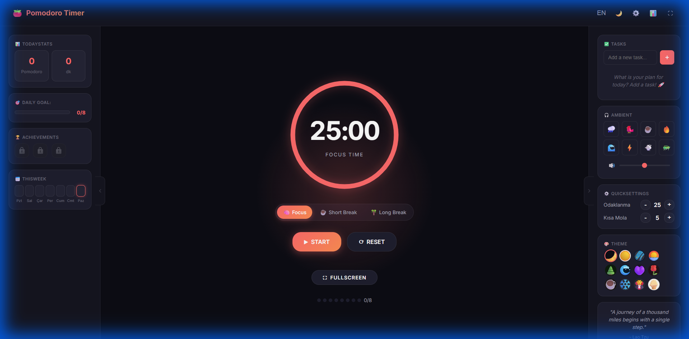
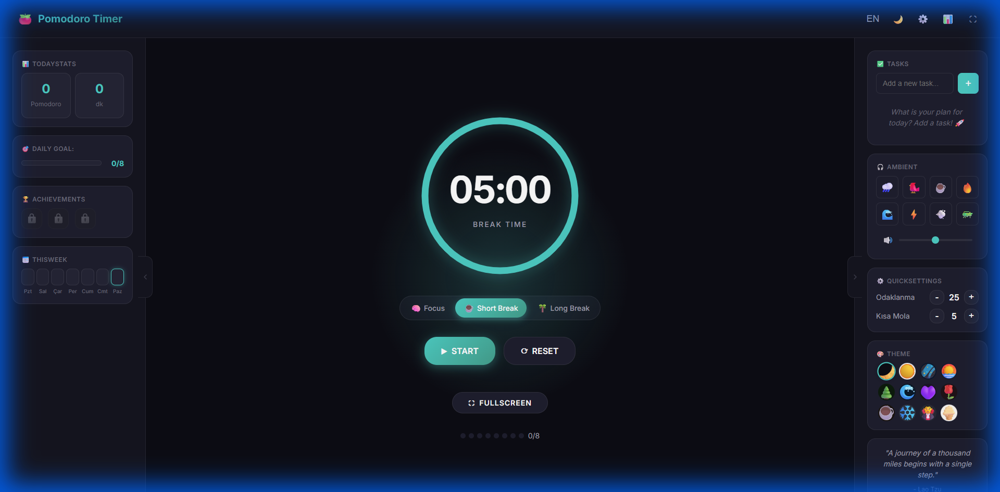
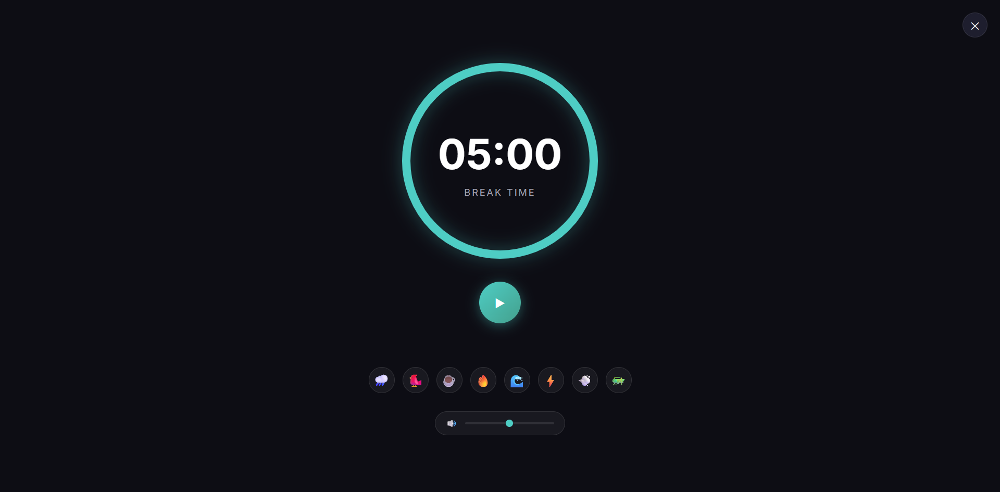
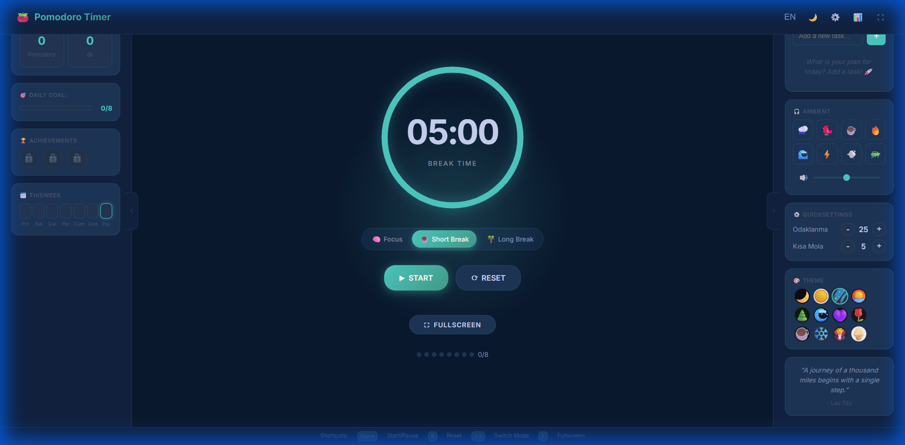
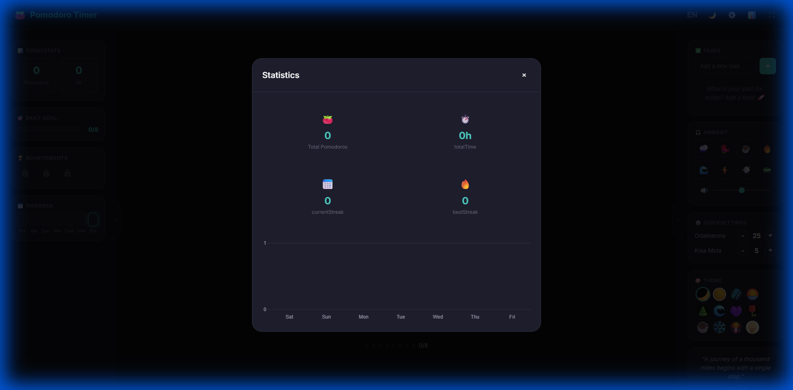
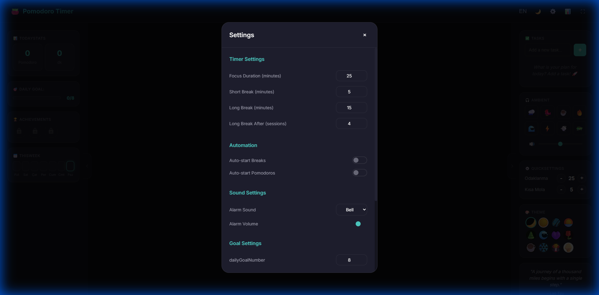
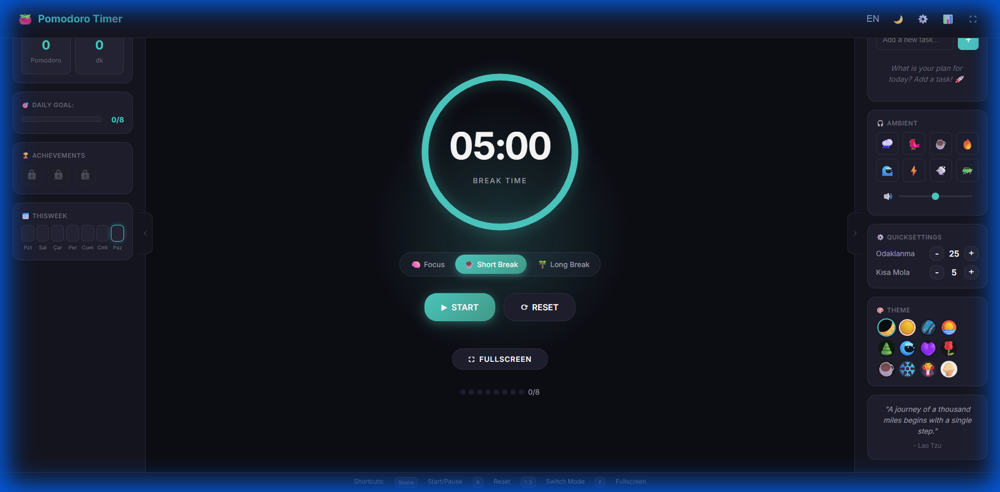

<p align="center">
  
</p>

<h1 align="center">🍅 Pomodoro Timer</h1>

<p align="center">
  <strong>A beautiful, modern, and fully offline-capable Pomodoro Timer PWA to boost your productivity.</strong>
</p>

<p align="center">
  
  
  
</p>

<p align="center">
  <a href="https://xkaptancan.github.io/pomodoro/" target="_blank">
    
  </a>
  <a href="https://github.com/xKaptanCan/pomodoro" target="_blank">
    
  </a>
</p>

---

## 📸 Screenshots

### Main Interface

*Clean 3-panel layout with timer, daily stats, and quick settings*

### Break Mode

*Dynamic color themes for different modes - Focus (Red), Short Break (Green), Long Break (Teal)*

### Fullscreen Focus Mode

*Distraction-free fullscreen mode with ambient sound controls*

### Theme Customization

*12+ beautiful themes including Aurora, Midnight, Ocean, Sunset, and more*

---

## ✨ Features

### ⏱️ Core Timer
- **3 Timer Modes**: Focus (25min), Short Break (5min), Long Break (15min)
- **Auto-switch**: Automatically transitions between focus and break modes
- **Visual Progress**: Beautiful circular progress indicator with glow effects
- **Session Tracking**: Track completed pomodoros with visual dots

### 📊 Statistics & Analytics

- **Daily Tracking**: Monitor your daily pomodoros and focus minutes
- **Weekly Charts**: Visualize your productivity trends with interactive charts
- **Streak Counter**: Maintain and track your daily streak
- **Goal Progress**: Set daily goals and track your progress

### ⚙️ Customization

- **Adjustable Durations**: Set custom timer lengths for each mode
- **Auto-start Options**: Configure automatic breaks and sessions
- **Alarm Sounds**: Choose from multiple notification sounds
- **Daily Goals**: Set personalized productivity targets

### 🎨 Themes

- **12+ Beautiful Themes**: Midnight, Aurora, Ocean, Sunset, Forest, and more
- **Dynamic Mode Colors**: Each timer mode has its own color scheme
- **Instant Preview**: See theme changes in real-time

### 🎵 Ambient Sounds
- **8 Ambient Sounds**: Rain, Cafe, Ocean, Fire, Forest, Wind, Thunder, Birds
- **Spotify Integration**: Connect your Spotify playlists
- **Volume Control**: Fine-tune each sound independently
- **Fullscreen Sound Bar**: Access sounds directly in fullscreen mode

### 🌐 Internationalization
- **English** (Default)
- **Turkish** (Türkçe)
- **Español**
- **Français**
- **Deutsch**
- **Português**
- **Русский**
- **中文**
- **日本語**
- Easy to add more languages

### 📱 PWA Features
- **Offline Support**: Works without internet connection
- **Installable**: Add to home screen on any device
- **Responsive**: Perfect on desktop, tablet, and mobile
- **Fast Loading**: Service Worker caching for instant loads

### 🎯 Extra Features
- ⌨️ **Keyboard Shortcuts**: Quick controls for power users
- 🔔 **Browser Notifications**: Get notified when timer completes
- 📑 **Tab Timer**: See remaining time in browser tab title
- 📝 **Task Manager**: Create and manage your todo list
- 💬 **Motivational Quotes**: Stay inspired during breaks
- 🏆 **Achievements**: Unlock badges as you progress
- 📅 **Weekly Overview**: See your week at a glance
- 🧘 **Wellness Reminders**: Eye rest and stretch reminders

---

## 🚀 Quick Start

### Option 1: Visit Online
Simply visit the hosted version and start using immediately!

### Option 2: Run Locally
```bash
# Clone the repository
git clone https://github.com/xKaptanCan/pomodoro.git

# Navigate to the directory
cd pomodoro

# Start a local server (any of these work)
npx http-server -p 3000
# or
python -m http.server 3000
# or
php -S localhost:3000

# Open http://localhost:3000 in your browser
```

### Option 3: Install as PWA
1. Visit the app in Chrome/Edge
2. Click the install icon in the address bar
3. Click "Install"
4. Launch from your desktop or start menu!

---

## ⌨️ Keyboard Shortcuts

| Key | Action |
|-----|--------|
| `Space` | Start/Pause timer |
| `R` | Reset timer |
| `1` | Focus mode |
| `2` | Short break |
| `3` | Long break |
| `F` | Toggle fullscreen |
| `Esc` | Exit fullscreen |
| `M` | Toggle sound |

---

## 🛠️ Tech Stack

- **HTML5** - Semantic markup
- **CSS3** - Modern styling with CSS Variables
- **Vanilla JavaScript** - No frameworks, pure JS
- **Service Worker** - Offline support
- **LocalStorage** - Data persistence
- **Web Audio API** - Ambient sounds

---

## 📁 Project Structure

```
pomodoroo/
├── index.html          # Main HTML file
├── manifest.json       # PWA manifest
├── sw.js               # Service Worker
├── css/
│   ├── style.css       # Main styles
│   ├── themes.css      # Theme definitions
│   ├── animations.css  # Animations
│   └── v2-components.css
├── js/
│   ├── app.js          # Main application
│   ├── timer.js        # Timer logic
│   ├── storage.js      # LocalStorage management
│   ├── i18n.js         # Internationalization
│   ├── stats.js        # Statistics
│   ├── themes.js       # Theme switcher
│   ├── sounds.js       # Ambient sounds
│   ├── tasks.js        # Task management
│   └── ...             # Other modules
├── icons/              # App icons
└── screenshots/        # README screenshots
```

---

## 🎨 Available Themes

| Theme | Description |
|-------|-------------|
| 🌙 Midnight | Deep dark blue theme |
| 🌌 Aurora | Northern lights inspired |
| 🌊 Ocean | Calm blue ocean vibes |
| 🌅 Sunset | Warm orange tones |
| 🌲 Forest | Natural green theme |
| ☁️ Cloud | Light and airy |
| 🍇 Grape | Rich purple theme |
| 🌸 Sakura | Soft pink blossoms |
| ⚡ Neon | Vibrant cyberpunk |
| 🔥 Volcano | Fiery red-orange |
| ❄️ Frost | Cool icy blues |
| 🌻 Sunny | Bright yellow energy |

---

## 📄 License

MIT License - Feel free to use, modify, and distribute!

---

## 🙏 Acknowledgments

- Pomodoro Technique® by Francesco Cirillo
- Ambient sounds from various free sources
- Icons and emojis for visual appeal

---

<p align="center">
  Made with ❤️ and 🍅
</p>

<p align="center">
  <strong>Stay focused. Take breaks. Be productive.</strong>
</p>
